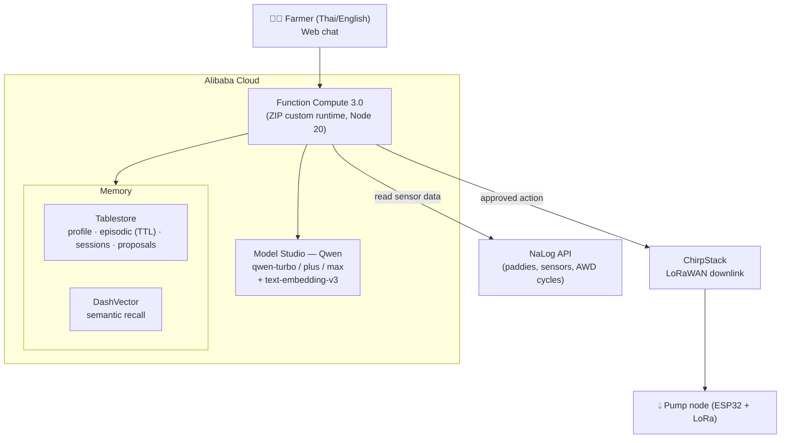

# NaLog Agent 🌾

> A **Qwen-powered MemoryAgent** that helps smallholder rice & sugarcane farmers in
> Isan, Thailand make better, cheaper irrigation decisions — and gets smarter every
> season by remembering each farmer and each paddy.
>
> Built on **Alibaba Cloud** (Model Studio / Qwen, Function Compute, Tablestore,
> DashVector) on top of the [NaLog / KhawTECH](https://khawtech.com) IoT irrigation platform.

**Hackathon track:** **Track 1 — MemoryAgent** (with **Track 4** human-in-the-loop
remediation: the agent proposes pump actions, a human approves, and the command is
sent to the field over LoRaWAN).

> **Built by [Alberto Roura](https://albertoroura.com)** — **Alibaba Cloud MVP for 8
> consecutive years (2018–2026)** and **Alibaba Cloud MVP of the Year 2019** (awarded
> globally at the MVP Global Summit). Apsara Conference organizer & co-presenter (covered
> the Hanguang 800 AI chip launch on Alibaba's channels) and a **Qwen VIP**. This project
> is the agritech mission I've been building toward: putting world-class Alibaba Cloud AI
> into the hands of farmers who could never normally afford it.

---

## Why this exists

KhawTECH puts affordable AWD (Alternate Wetting and Drying) sensors in the fields of
smallholder farmers who can't afford big-ag technology. The sensors produce data — but
raw data isn't advice. Good agronomic guidance has to be **hyper-local and remembered**:
*this* paddy drains faster after re-levelling, *this* farmer prefers to approve the pump
himself near flowering, *last* season AWD here cut pumping 31% with no yield loss.

The NaLog Agent is the agronomist with perfect memory in every farmer's pocket. It:

- **Accumulates experience** per farmer and per paddy, across sessions and seasons.
- **Forgets in a timely way** — memories decay with age and are physically expired via
  Tablestore TTL unless they keep proving useful (reinforcement).
- **Recalls within a tiny context window** — top-K semantic recall + summarisation, so it
  works for offline-first, low-bandwidth rural deployments.
- **Never acts blindly** — any pump action is a *proposal* a human approves; only then is a
  LoRaWAN downlink sent.
- **Interoperable** — the same capabilities are exposed as an **MCP server**, so any MCP
  client (Claude, Cursor, other agents) can use NaLog's tools. See [Use it from any MCP
  client](#use-it-from-any-mcp-client).

## Architecture



See [`docs/ARCHITECTURE.md`](docs/ARCHITECTURE.md) for the full design and the
[3-tier memory model](docs/ARCHITECTURE.md#memory-model).

## Alibaba Cloud services used (proof of deployment)

| Service | Used for | Code |
|---|---|---|
| **Model Studio (Qwen)** | All reasoning + Thai/English NLG, tool use | [`src/llm/dashscope.js`](src/llm/dashscope.js) |
| **Model Studio (embeddings)** | Semantic memory vectors (`text-embedding-v3`) | [`src/llm/embeddings.js`](src/llm/embeddings.js) |
| **Tablestore** | Persistent memory (profile, episodic w/ TTL, sessions, proposals) | [`src/memory/store/tablestoreStore.js`](src/memory/store/tablestoreStore.js) |
| **DashVector** | Semantic recall of past field experience | [`src/memory/vector/dashVector.js`](src/memory/vector/dashVector.js) |
| **Function Compute 3.0** | Serverless backend (ZIP custom runtime, no ACR) | [`deploy/fc-zip-build.sh`](deploy/fc-zip-build.sh), [`deploy/fc-deploy.mjs`](deploy/fc-deploy.mjs) |

The single-file backend-on-Alibaba proof for judges is
[`docs/proof-of-alibaba-deployment.md`](docs/proof-of-alibaba-deployment.md).

## Quick start (local, Docker)

```bash
cp .env.example .env          # add your DASHSCOPE_API_KEY (Model Studio)
docker compose build
docker compose run --rm app npm run seed   # seed the demo farmer's memory
docker compose up                          # http://localhost:8080
```

Defaults run fully offline-capable: `STORAGE_DRIVER=local`, `VECTOR_DRIVER=local`,
`NALOG_USE_DEMO=true` (a built-in Kut Chum, Yasothon demo farm). Only a Model Studio
API key is required to talk to Qwen.

Try asking (Thai or English):
- *"นาแปลง 3 ตอนนี้ต้องสูบน้ำไหม?"* ("Does Paddy 3 need pumping now?")
- *"What's the water level in Paddy 3 and what do you recommend?"*

The agent reads the (demo) sensor trend, recalls past experience, and — if a pump action
makes sense — shows an **approval card**. Approving it sends the LoRaWAN downlink (simulated
unless `CHIRPSTACK_*` is configured).

## Run on Alibaba Cloud

1. Provision storage: set `STORAGE_DRIVER=alibaba`, `VECTOR_DRIVER=dashvector` and the
   `TABLESTORE_*` / `DASHVECTOR_*` vars in `.env`, then:
   ```bash
   docker compose run --rm app npm run provision
   ```
2. Build the code package and deploy to Function Compute (ZIP-based custom runtime —
   no container image / ACR needed):
   ```bash
   npm run deploy:build    # builds dist/nalog-agent-fc.zip (Linux node_modules via Docker)
   npm run deploy:fc       # creates/updates the FC function + HTTP trigger
   ```
   Function Compute and Tablestore run in Thailand `ap-southeast-7` (Bangkok) by default.
   DashVector and Model Studio aren't offered there, so they stay on their Singapore/global
   endpoints and are reached over HTTPS.
3. Smoke-test the live deployment end-to-end:
   ```bash
   BASE_URL=https://<your-fc-trigger>.ap-southeast-7.fcapp.run npm run smoke:deploy
   ```

Full steps: [`docs/ARCHITECTURE.md`](docs/ARCHITECTURE.md), [`deploy/fc-zip-build.sh`](deploy/fc-zip-build.sh)
and [`deploy/fc-deploy.mjs`](deploy/fc-deploy.mjs).

## Use it from any MCP client

The agent's capabilities are also exposed as a **Model Context Protocol (MCP) server** over
stdio, so Claude Desktop, Cursor, or any other agent can drive NaLog directly — the same tool
handlers power both the in-app ReAct loop and MCP (one implementation, two surfaces).

```bash
docker compose run --rm app npm run mcp          # serve MCP over stdio
docker compose run --rm app node scripts/mcp-smoke.js   # verify with a real MCP client
```

Tools exposed: `get_farm_overview`, `get_paddy_status`, `get_sensor_history`, `recall_memory`,
`save_memory`, `propose_irrigation` (human-in-the-loop). Implementation:
[`src/mcp/server.js`](src/mcp/server.js).

## Tests & self-check

```bash
docker compose run --rm -e NODE_ENV=production app npm test          # unit tests
docker compose run --rm -e NODE_ENV=production app npm run check     # boots app, hits endpoints
docker compose run --rm app node scripts/mcp-smoke.js                # MCP server end-to-end
```

## How this maps to the judging criteria

| Criterion | Where it shows up |
|---|---|
| **Innovation & AI (30%)** | Sophisticated Qwen use (model tiering turbo/plus/max, tool-calling, embeddings); **MCP server** exposing custom skills; a novel **3-tier decaying memory** (soft recency decay + reinforcement + hard Tablestore TTL) with rank-based, metric-agnostic semantic recall. |
| **Technical Depth & Engineering (30%)** | Modular, swappable storage/vector drivers; bounded ReAct loop with graceful degradation; Express 5 service; clean tests + self-check + MCP smoke test; serverless ZIP runtime on Function Compute. |
| **Problem Value & Impact (25%)** | Real deployment context (Kut Chum, Yasothon) — water/diesel savings, methane reduction, food security for poor families; open-source (MIT), productizable across co-ops and SE Asia. |
| **Presentation & Documentation (15%)** | Architecture diagram (Mermaid), per-turn token + recalled-memory visualisation in the UI, full docs (`README`, `docs/ARCHITECTURE.md`, `docs/proof-of-alibaba-deployment.md`). |

## Project layout

```
src/
  llm/          Qwen client (Model Studio) + embeddings
  memory/       3-tier memory: store (local|Tablestore) + vector (local|DashVector)
  agent/        ReAct loop, tools, prompts
  integrations/ NaLog read connector, ChirpStack downlink, crop calendar, demo data
  routes/       chat, proposals (HITL), health
  mcp/          MCP server exposing the agent tools over stdio
public/         web chat UI (+ memory panel)
deploy/         Tablestore/DashVector provisioning, Function Compute deploy
docs/           architecture, Alibaba proof
```

## License

MIT — see [LICENSE](LICENSE). Open source so any farmer co-op, NGO, or developer can run it.
