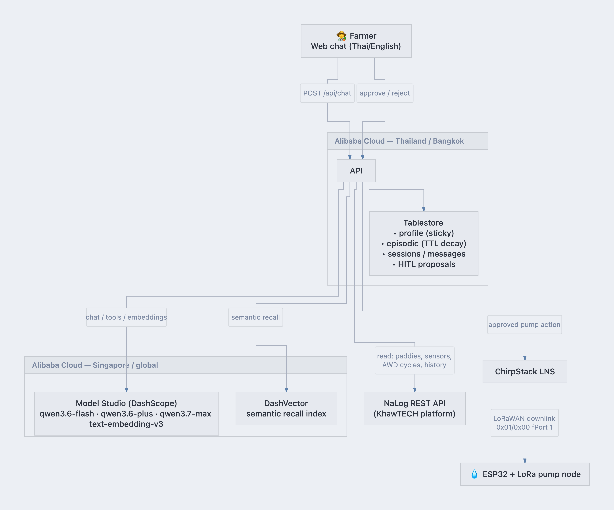

# NaLog Agent 🌾

[](https://github.com/khawtech/nalog-agent/actions/workflows/ci.yml)
[](LICENSE)


> My father-in-law died alone in a rice paddy in Isan, checking water levels by eye.
> That's the trip millions of Thai farmers still make every day — walking kilometres
> in 40 °C heat just to see if the pump is still running. Last season, the AWD sensors
> we deployed on one family's paddies cut pumping by 31% with zero yield loss.
> Every sensor we add is one less reason for that walk. **Hackathon funding goes
> directly into sensors and LoRa gateways.**

**NaLog Agent** is a **Qwen-powered MemoryAgent** that turns those sensors into
personalised, remembered agronomic advice for smallholder rice and sugarcane farmers —
an agronomist with perfect memory in every farmer's pocket. Built on **Alibaba Cloud**
(Model Studio / Qwen, Function Compute, Tablestore, DashVector) on top of the
[NaLog / KhawTECH](https://nalog.khawtech.com) IoT irrigation platform.

> **Production system — not a hackathon prototype.** This is the same backend deployed
> on Alibaba Cloud Function Compute in Bangkok (`ap-southeast-7`), serving real farmers
> in Isan, Thailand through the [KhawTECH](https://nalog.khawtech.com) NaLog platform. It
> handles real conversations, real sensor data, and real pump commands. The demo mode
> included here uses a bundled dataset so anyone can run it locally — the production
> path is one `STORAGE_DRIVER=alibaba` away.

**Hackathon track:** **Track 1 — MemoryAgent** (primary submission). The same codebase
also includes an autonomous sensor-alert webhook (`POST /api/alerts`) that *could* qualify
for Track 4 — Autopilot Agent, but this project is entered as a MemoryAgent. See
[Track 1 rationale](#track-1-rationale) below.

> **Built by [Alberto Roura](https://albertoroura.com)** — **[Alibaba Cloud MVP](https://mvp.alibabacloud.com/mvp/detail/105) for 8
> consecutive years (2018–2026)** and **Alibaba Cloud MVP of the Year 2019** (awarded
> globally at the MVP Global Summit). Apsara Conference organizer & co-presenter (covered
> the Hanguang 800 AI chip launch on Alibaba's channels) and a **Qwen VIP**. This project
> is the agritech mission I've been building toward: putting world-class Alibaba Cloud AI
> into the hands of farmers who could never normally afford it.

---

## Why this exists

KhawTECH puts affordable AWD (Alternate Wetting and Drying) sensors in the fields of
smallholder farmers who can't afford big-ag technology. The sensors produce data — but
raw data isn't advice. Good agronomic guidance has to be **hyper-local and remembered**:
*this* paddy drains faster after re-levelling, *this* farmer prefers to approve the pump
himself near flowering, *last* season AWD here cut pumping 31% with no yield loss.

NaLog Agent is the agronomist with perfect memory in every farmer's pocket. It:

- **Accumulates experience** per farmer and per paddy, across sessions and seasons.
- **Detects and supersedes contradictions** — when learning extracts a fact that
  conflicts with an existing memory (similarity 0.50–0.85), a cheap LLM adjudication
  decides if the new fact supersedes the old one. The old memory is kept for
  auditability but excluded from recall. See [the benchmark](docs/BENCHMARK.md).
- **Forgets in a timely way** — memories decay with age and are physically expired via
  Tablestore TTL unless they keep proving useful (reinforcement). Measured, not claimed:
  see the [reproducible benchmark](docs/BENCHMARK.md).
- **Safety rescue floor** — critical memories (reinforcement >= 5) always surface in
  recall results even if they scored below the top-K cutoff. Ensures safety-critical
  knowledge (e.g. "keep flooded during flowering") is never missed on an unrelated query.
- **Recalls within a tiny context window** — 4-tier hybrid recall: vector-first top-K
  (DashVector + `qwen3-rerank` cross-encoder) + BM25-inspired keyword overlap + recency
  decay + reinforcement scoring, then summarisation — so it works for offline-first,
  low-bandwidth rural deployments.
- **Sees the field** — attach a photo and `qwen3-vl-plus` reads crop condition, water,
  pests and weeds into the reasoning loop.
- **Acts autonomously, but never blindly** — sensor alerts trigger unprompted reasoning
  turns (`POST /api/alerts`); any pump action is a *proposal* a human approves; only then
  is a LoRaWAN downlink sent.
- **Streams its work** — SSE streaming of Qwen thinking, live tool calls, and the reply,
  so the farmer watches the agent check real sensors before trusting its advice.
  Includes a **memory trace** (which memories were recalled, their scores, what was
  excluded) and a **memory diff** ("2 new, 1 reinforced, 1 superseded") after each turn.
- **Interoperable** — the same capabilities are exposed as an **MCP server**, so any MCP
  client (Claude, Cursor, other agents) can use NaLog's tools. See [Use it from any MCP
  client](#use-it-from-any-mcp-client).

**Judges:** Start with [`docs/JUDGE-GUIDE.md`](docs/JUDGE-GUIDE.md) for a 2-minute overview.

## Architecture



See [`docs/ARCHITECTURE.md`](docs/ARCHITECTURE.md) for the full design and the
[4-tier hybrid memory model](docs/ARCHITECTURE.md#memory-model).

## Alibaba Cloud services used (proof of deployment)

| Service | Used for | Code |
|---|---|---|
| **Model Studio (Qwen)** | 4-tier model routing: `qwen3.7-max` (thinking, tool use) · `qwen3.6-plus` (Thai/English NLG) · `qwen3.6-flash` (memory extraction) · `qwen3-vl-plus` (field photos); SSE streaming | [`dashscope.js`](src/llm/dashscope.js), [`tools.js`](src/agent/tools.js) |
| **Model Studio (embeddings)** | Semantic memory vectors (`text-embedding-v3`) | [`embed()`](src/llm/embeddings.js) |
| **Model Studio (rerank)** | `qwen3-rerank` cross-encoder re-ordering of recalled memories | [`rerank.js`](src/llm/rerank.js) |
| **Tablestore** | Persistent memory (profile, episodic w/ TTL, sessions, proposals); `BatchGetRow` point lookups on the recall hot path | [`tablestoreStore.js`](src/memory/store/tablestoreStore.js) |
| **DashVector** | Vector-first semantic recall of past field experience | [`dashVector.js`](src/memory/vector/dashVector.js) |
| **Function Compute 3.0** | Serverless backend (ZIP custom runtime, no ACR) | [`fc-zip-build.sh`](deploy/fc-zip-build.sh), [`fc-deploy.mjs`](deploy/fc-deploy.mjs) |

The single-file backend-on-Alibaba proof for judges is
[`docs/proof-of-alibaba-deployment.md`](docs/proof-of-alibaba-deployment.md).

## Quick start (local, Docker)

```bash
cp .env.example .env          # add your DASHSCOPE_API_KEY (Model Studio)
docker compose build
docker compose run --rm app npm run seed   # seed the demo farmer's memory
docker compose up                          # http://localhost:8080
```

Defaults run fully offline-capable: `STORAGE_DRIVER=local`, `VECTOR_DRIVER=local`,
`NALOG_USE_DEMO=true` (a built-in Kut Chum, Yasothon demo farm). Only a Model Studio
API key is required to talk to Qwen.

The bundled web chat UI (`public/`) streams the agent's work live (thinking → tool calls
→ reply tokens), shows an expandable tool trace per answer, renders approval cards for
pump proposals, lets you attach a field photo (Qwen-VL), and has a memory panel showing
what the agent remembers (with reinforcement counters).

Try asking (Thai or English):
- *"นาแปลง 3 ตอนนี้ต้องสูบน้ำไหม?"* ("Does Paddy 3 need pumping now?")
- *"What's the water level in Paddy 3 and what do you recommend?"*

The agent reads the (demo) sensor trend, recalls past experience, and — if a pump action
makes sense — shows an **approval card**. Approving it sends the LoRaWAN downlink (simulated
unless `CHIRPSTACK_*` is configured).

Simulate the autonomous alert path (sensor alert → unprompted agent turn → proposal):

```bash
curl -X POST http://localhost:8080/api/alerts -H 'Content-Type: application/json' \
  -d '{"paddyId":"paddy-rice-3","metric":"water_level","value":-16.2,"unit":"cm","threshold":-15,"direction":"below"}'
```

## Production deployment on Alibaba Cloud

This repo is the **same codebase running in production** at KhawTECH. Switch from local
dev to production by changing the driver env vars:

1. Provision storage: set `STORAGE_DRIVER=alibaba`, `VECTOR_DRIVER=dashvector` and the
   `TABLESTORE_*` / `DASHVECTOR_*` vars in `.env`, then:
   ```bash
   docker compose run --rm app npm run provision
   ```
2. Build the code package and deploy to Function Compute (ZIP-based custom runtime —
   no container image / ACR needed):
   ```bash
   npm run deploy:build    # builds dist/nalog-agent-fc.zip (Linux node_modules via Docker)
   npm run deploy:fc       # creates/updates the FC function + HTTP trigger
   ```
   Function Compute and Tablestore run in Thailand `ap-southeast-7` (Bangkok) by default.
   DashVector and Model Studio aren't offered there, so they stay on their Singapore/global
   endpoints and are reached over HTTPS.
3. Smoke-test the live deployment end-to-end:
   ```bash
   BASE_URL=https://<your-fc-trigger>.ap-southeast-7.fcapp.run npm run smoke:deploy
   ```
4. (Optional) Open the live web UI as a real farmer — mint a short-lived Firebase ID
   token and get a ready-to-open URL (needs `FIREBASE_WEB_API_KEY` in `.env` and a
   service-account JSON at `local/firebase-service-account.json`):
   ```bash
   BASE_URL=https://<your-fc-trigger>.ap-southeast-7.fcapp.run \
     node scripts/firebase-test-token.mjs <farmer-uid>
   ```

In production, the KhawTECH NaLog farmer dashboard connects to this backend via the
Function Compute HTTP trigger, forwarding the farmer's Firebase ID token for identity
scoping.

Full steps: [`docs/ARCHITECTURE.md`](docs/ARCHITECTURE.md), [`deploy/fc-zip-build.sh`](deploy/fc-zip-build.sh)
and [`deploy/fc-deploy.mjs`](deploy/fc-deploy.mjs).

**Deploy-only dependencies** (not needed for local dev or tests):
```bash
npm install --no-save @alicloud/fc20230330 @alicloud/openapi-client @alicloud/tea-util
```
## Use it from any MCP client

The agent's capabilities are exposed as a **Model Context Protocol (MCP) server** over
stdio, so Claude Desktop, Cursor, or any other agent can drive NaLog directly — the same tool
handlers power both the in-app ReAct loop and MCP (one implementation, two surfaces).

```bash
docker compose run --rm app npm run mcp          # serve MCP over stdio
docker compose run --rm app node scripts/mcp-smoke.js   # verify with a real MCP client
```

Tools exposed (all 9, same as the ReAct loop): `get_farm_overview`, `get_paddy_status`,
`get_sensor_history`, `recall_memory`, `save_memory`, `update_profile`,
`get_irrigation_history`, `analyze_field_photo` (Qwen-VL), `propose_irrigation`
(human-in-the-loop). Implementation: [`src/mcp/server.js`](src/mcp/server.js).

**Cursor / Claude Desktop** — add to `.cursor/mcp.json` or `claude_desktop_config.json`:

```json
{
  "mcpServers": {
    "nalog-agent": {
      "command": "node",
      "args": ["src/mcp/server.js"],
      "cwd": "/path/to/nalog-agent",
      "env": {
        "DASHSCOPE_API_KEY": "sk-your-key",
        "MCP_FARMER_ID": "your-user-id"
      }
    }
  }
}
```

`MCP_FARMER_ID` scopes all memory to a specific user. Without it, the demo farmer
is used. Set `NALOG_USE_DEMO=true` (default) to use bundled farm data, or point
`NALOG_API_URL` to your own platform.

## Build on top of it

This is an **open-source, MIT-licensed** MemoryAgent designed to be extended by
agritech builders, co-ops, NGOs, and developers serving farming communities.

- **[Integration guide](docs/INTEGRATION.md)** — three paths: MCP memory-only,
  full MCP, or platform connector replacement.
- **[Connector API reference](docs/CONNECTOR-API.md)** — the REST contract your
  platform needs to implement (with example payloads).
- **Swappable storage** — `local` (JSON file) for dev, `alibaba` (Tablestore +
  DashVector) for production. Add your own driver by implementing the store/vector
  interfaces documented in the integration guide.

## Tests, benchmark & CI

```bash
npm test       # 125 tests (memory, supersession, consolidation, keyword scoring, safety rescue, store, vector, routes, tools, auth, agent loop, streaming, …)
npm run check  # boots app, hits endpoints
npm run bench  # reproducible memory-retrieval benchmark → docs/BENCHMARK.md + chart
```

Tests are fully deterministic (demo mode, no API keys, no external services) and cover:

| Area | Tests |
|---|---|
| **Memory** | 4-tier hybrid recall, vector-first hydration, keyword scoring, reinforcement, decay, safety rescue floor, consolidation, purge + orphan vector cleanup, graceful fallbacks |
| **Supersession** | LLM adjudication detects contradictions, supersede marks old memory, recall excludes superseded, auditability preserved, failure handling |
| **Memory learning** | Autonomous post-turn extraction (mock LLM), dedup by exact text and semantic similarity, contradiction adjudication + supersession, diff stats, failure handling |
| **Consolidation** | Expired memories compressed into summaries before purge, LLM failure handling, metadata preservation |
| **Memory trace** | `recallWithTrace` returns candidate/superseded/rescued counts, `buildContext` exposes trace, `memory_trace` SSE event emitted |
| **Agent loop** | Scripted ReAct rounds: tool execution, chat-tier composition, proposals, event streaming, per-turn usage, cross-session memory, `memory_diff` SSE event |
| **Auth** | API-key gate, Firebase ID-token verification (signature, expiry, audience, issuer, alg-confusion), farmer scoping |
| **Routes** | Health, chat validation, SSE streaming protocol, image validation, alert webhook, proposal ownership + lifecycle |
| **Store / Vector** | Profile CRUD, episodic listing, `getEpisodicByIds`, TTL expiry, upsert/query/delete, filters, persistence |
| **Rerank** | DashScope parsing, disabled/offline/failure fallbacks |
| **Domain** | Crop calendar (rice & sugarcane), demo dataset, NaLog connector, embeddings, tool handlers |

The **memory benchmark** ([docs/BENCHMARK.md](docs/BENCHMARK.md)) shows why the 4-tier
hybrid blend exists: on a labeled two-season dataset it reaches **100% Recall@5** and
always ranks the current fact above its outdated twin, while a pure vector search leaks
twice as many stale memories into the context. An **ablation study** proves each mechanism
earns its place: removing supersession leaks 5 stale facts; removing keyword scoring
also leaks 5; removing reinforcement drops Recall@5 to 96.4%; supersession alone without
the blend also loses recall quality.


CI runs on every push and PR via [GitHub Actions](.github/workflows/ci.yml) on Node 20, 22 and 24 and includes `npm test`, `npm run check` (selfcheck), the MCP client smoke test, and `npm audit`. Node 24 is the active LTS dev/Docker target; Node 20 is kept in the matrix to match Alibaba Function Compute's bundled custom-runtime version.

## Track 1 rationale

This project is submitted to **Track 1 — MemoryAgent**:

- **4-tier hybrid recall** (semantic + keyword + recency + reinforcement) with explicit
  relevance scoring, **benchmarked** on a labeled dataset ([docs/BENCHMARK.md](docs/BENCHMARK.md))
- Vector-first recall (DashVector candidates → Tablestore point lookups →
  `qwen3-rerank` cross-encoder → BM25-inspired keyword overlap) — O(topK) regardless
  of history size. Four scoring signals blended:
  `0.50×semantic + 0.10×keyword + 0.25×recency + 0.15×reinforcement`
- **LLM-adjudicated supersession**: when a new fact contradicts an existing memory
  (similarity 0.50–0.85), a cheap `qwen3.6-flash` call adjudicates whether the old
  fact is superseded. The old memory is marked `supersededBy` and excluded from
  recall — but kept in storage so you can always audit what changed and when
- Soft forgetting via recency decay (120-day half-life) + reinforcement on reuse
- Hard forgetting via Tablestore TTL (~400 days physical deletion)
- Top-K recall within a deliberately limited context window
- Autonomous post-turn learning (cheap `qwen3.6-flash` pass extracts durable facts) with
  **3-tier dedup**: exact text match, semantic near-duplicate (≥ 0.85), and contradiction
  adjudication (0.50–0.85) — preventing both duplicates and conflicting facts
- **Safety rescue floor**: critical memories (reinforcement >= 5) always surface even at
  low semantic similarity — ensures "keep flooded during flowering" is never missed
- **Explainable recall**: `memory_trace` SSE event shows which memories were recalled,
  their scores (semantic, keyword, recency, reinforcement), what was superseded/excluded,
  and which were safety-rescued
- **Memory diff**: `memory_diff` SSE event after each turn ("2 new, 1 reinforced,
  1 superseded") makes the memory system visible without trusting output
- **Ablation study**: benchmark proves each mechanism (supersession, reinforcement,
  keyword, blend) independently earns its place
- **Memory lifecycle**: expired memories are purged from both store and vector index;
  orphan vector entries (e.g. from Tablestore TTL) are cleaned lazily during recall
- Cross-session, cross-season memory accumulation

**Could also qualify for Track 4 — Autopilot Agent** (not submitted under that track):
the `POST /api/alerts` webhook runs an end-to-end workflow — sensor threshold breach →
unprompted agronomic reasoning over live field data → irrigation proposal →
human-in-the-loop approval → LoRaWAN pump command — but the hackathon entry is MemoryAgent-first.

## How this maps to the judging criteria

| Criterion | Where it shows up |
|---|---|
| **Technical Depth & Engineering (30%)** | Deliberate 4-tier Qwen routing (`qwen3.7-max` thinking + tool calls, `qwen3.6-plus` NLG, `qwen3.6-flash` extraction + adjudication, `qwen3-vl-plus` vision) with hybrid-thinking control and SSE streaming; **MCP server** exposing all 9 tools; a **benchmarked 4-tier hybrid recall** with **LLM-adjudicated supersession** (vector-first + `qwen3-rerank` cross-encoder + BM25 keyword overlap + recency decay + reinforcement + contradiction detection + Tablestore TTL + 3-tier dedup + orphan-vector cleanup) — **100% Recall@5, 0 stale facts served** vs Mem0-style baseline at 92.9% with 10 stale leaks; verified Firebase identity (RS256 against Google certs, no SDK); 125 automated tests + CI; **ablation study** proving each mechanism independently earns its place. |
| **Innovation & AI Creativity (30%)** | **4-tier hybrid recall** (semantic + keyword + recency + reinforcement) fuses dense vector retrieval with BM25-inspired lexical matching — each signal proven necessary by ablation; **LLM-adjudicated contradiction supersession** — when a new fact contradicts an old memory (sim 0.50–0.85), a cheap `qwen3.6-flash` adjudication decides if the old fact is superseded; the old memory is kept for auditability but excluded from recall; **safety rescue floor** surfaces critical memories regardless of query similarity; **explainable recall** (`memory_trace` SSE) and **memory diff** (`memory_diff` SSE) make the memory system transparent; autonomous sensor-alert turns with human-in-the-loop actuation; cross-encoder reranking; field-photo grounding via Qwen-VL; modular storage/vector drivers; bounded ReAct loop with graceful degradation; autonomous post-turn learning with 3-tier dedup (exact + semantic + adjudication); token-budget discipline with concurrency-safe per-turn reporting and retry/backoff. |
| **Problem Value & Impact (25%)** | **Production deployment** serving real farmers (Kut Chum, Yasothon) — water/diesel savings, methane reduction, food security for poor families; open-source (MIT), productizable across co-ops and SE Asia. |
| **Presentation & Documentation (15%)** | Architecture diagram, live streaming UI with tool-trace transparency, reproducible benchmark with chart ([docs/BENCHMARK.md](docs/BENCHMARK.md)), full docs (`README`, `docs/ARCHITECTURE.md`, `docs/proof-of-alibaba-deployment.md`, [`docs/SECURITY.md`](docs/SECURITY.md)), [blog post](https://albertoroura.com/video/nalog-agent-qwen-memory-agent-demo/). |

## Project layout

```
src/
  llm/          Qwen client (Model Studio): chat/stream/JSON, embeddings, qwen3-rerank
  memory/       memory system: store (local|Tablestore) + vector (local|DashVector)
  agent/        ReAct loop (streaming events), tools (incl. Qwen-VL photo), prompts
  integrations/ NaLog read connector, ChirpStack downlink, crop calendar, demo data
  routes/       chat (SSE), proposals (HITL, ownership), alerts (autonomous), health
  middleware/   API-key gate + verified Firebase farmer identity
  mcp/          MCP server exposing the agent tools over stdio
public/         web chat UI (streaming, tool trace, photo upload, memory panel)
deploy/         Tablestore/DashVector provisioning, Function Compute deploy
scripts/        selfcheck, MCP smoke, deployment smoke, memory benchmark, demo seed
test/           125 automated tests (all deterministic, no cloud dependencies)
docs/           architecture, Alibaba proof, benchmark, security, integration guide, connector API
```

## Blog post

[Adding a Qwen-powered Memory-Augmented Agent to the NaLog Platform](https://albertoroura.com/video/nalog-agent-qwen-memory-agent-demo/)

## YouTube video

[Adding a Qwen-powered Memory-Augmented Agent to the NaLog Platform](https://www.youtube.com/watch?v=tzedZsHiYXU)

## License

MIT — see [LICENSE](LICENSE). Open source so any farmer co-op, NGO, or developer can run it.
