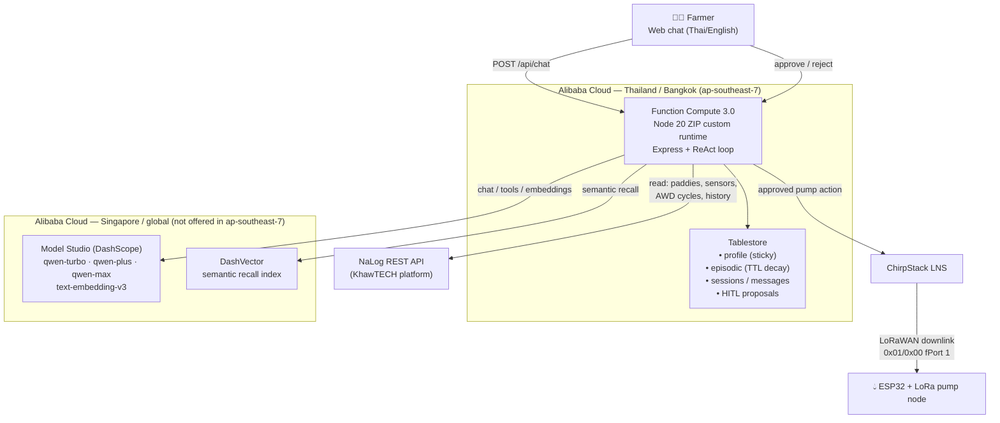

# Architecture

The NaLog Agent is a stateful **ReAct MemoryAgent**. A single Node service
(deployable as an Alibaba Cloud Function Compute ZIP custom runtime) orchestrates Qwen
reasoning, a three-tier memory system, a read-only connector to the NaLog IoT platform,
and a human-in-the-loop irrigation control path over LoRaWAN.

## System diagram



## Request flow (one turn)

1. **Load context** — fetch the farmer's profile + top-K relevant memories (semantic +
   recency + reinforcement), recent conversation, and a farm/paddy overview.
2. **Reason** — `qwen-max` runs a tool-calling loop (up to 6 rounds):
   `get_farm_overview`, `get_paddy_status`, `get_sensor_history`,
   `get_irrigation_history`, `recall_memory`, `save_memory`,
   `update_profile`, `propose_irrigation`.
3. **Ground in real data** — irrigation advice must be based on actual sensor readings
   pulled from NaLog (or the bundled demo dataset).
4. **Human-in-the-loop** — a pump action becomes a `proposal` (never executed directly).
5. **Persist & learn** — the turn is saved; a cheap `qwen-turbo` pass extracts durable
   profile facts and episodic learnings autonomously.
6. **Act locally (on approval)** — approving a proposal enqueues a ChirpStack downlink.

## MCP surface

The core tool handlers are also exposed as a **Model Context Protocol (MCP) server** over
stdio ([`src/mcp/server.js`](../src/mcp/server.js)), built on `@modelcontextprotocol/sdk`.
This lets external MCP clients (Claude Desktop, Cursor, other agents) read NaLog field state,
query/append the farmer's memory, and prepare human-in-the-loop irrigation proposals — without
duplicating any logic. One implementation, two integration paths (web chat + MCP).

## Memory model

Three tiers, matching the MemoryAgent track requirements:

| Tier | Store | Behaviour | Example |
|---|---|---|---|
| **Profile** (sticky) | Tablestore `profiles` | Rarely changes; high confidence | `preferred_language: th`, `irrigation_style: manual_approval` |
| **Episodic** (decaying) | Tablestore `episodic` + DashVector | Dated experience; TTL ~2 seasons; reinforced on reuse | "Paddy 3 drains +5→−15cm in ~4 days" |
| **Semantic recall** | DashVector | Embeds the situation, returns the few most similar memories | "last time levels dropped this fast pre-flowering…" |

**Relevance score** at recall:

```
score = 0.60 · semantic_similarity      (DashVector cosine)
      + 0.25 · recency                   (exp half-life ≈ 120 days)
      + 0.15 · reinforcement             (min(reuse_count / 5, 1))
```

**Timely forgetting** is twofold:
- *soft* — old, unused memories sink in ranking and stop being recalled;
- *hard* — Tablestore TTL physically deletes episodic rows after ~400 days unless rewritten.

**Limited context window** — recall is deliberately top-K (default 5) and summarised into a
compact block, never a full memory dump. This is what makes it viable for offline-first,
low-bandwidth rural deployments.

## Storage abstraction

The agent code is storage-agnostic. Drivers are selected by env:

| | `local` (dev/offline) | `alibaba` / `dashvector` (production) |
|---|---|---|
| Structured memory | JSON file (`LocalStore`) | **Tablestore** (`TablestoreStore`) |
| Vectors | in-process cosine (`LocalVector`) | **DashVector** |

This keeps development fast and tests deterministic while production uses managed Alibaba
Cloud services.

## Token-budget discipline (a judged criterion)

- **Model tiering**: `qwen-turbo` for cheap extraction/routing, `qwen-plus` for chat,
  `qwen-max` only for the agronomic reasoning loop.
- **Summarised recall** rather than dumping raw history.
- **Running token tally** surfaced per turn in the API response and the UI.

## Deploying on Alibaba Cloud

1. Create a Tablestore instance in Thailand `ap-southeast-7` (Bangkok). Create the
   DashVector cluster in Singapore `ap-southeast-1` — DashVector isn't offered in
   `ap-southeast-7`, so it (and Model Studio) are reached cross-region over HTTPS.
2. Put credentials in `.env` (`STORAGE_DRIVER=alibaba`, `VECTOR_DRIVER=dashvector`).
3. `npm run provision` — creates tables (with TTL) and the vector collection.
4. `npm run deploy:build` then `npm run deploy:fc` — builds the code ZIP (Linux
   `node_modules` via Docker) and creates/updates the Function Compute function
   (ZIP-based **custom runtime**, `custom.debian10` with bundled Node 20 — no ACR)
   plus its HTTP trigger.
5. Get the trigger URL and point the web client (or LINE webhook, in production) at it.

## Notes / known integration details

- NaLog's API ignores server-side time filters on sensor history, so the connector filters
  client-side.
- NaLog's process Lambda had a bug encoding every pump command as OFF; this agent encodes
  `on → 0x01` / `off → 0x00` correctly (see `src/integrations/chirpstack.js`).
- The production farmer channel is LINE; this submission ships web chat, with LINE as a
  drop-in additional route.
