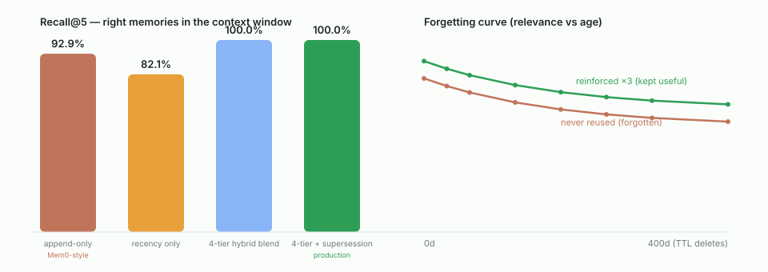

# Memory retrieval benchmark

*Generated by `npm run bench` (`scripts/benchmark-memory.mjs`) — fully offline and
deterministic (hash-based pseudo-embeddings, fixed age offsets), so anyone can reproduce
these exact numbers.*

**Setup.** A synthetic Isan farmer with **46 memories across two seasons**: for each
agronomic topic, the *current* fact (recent, sometimes reinforced by actual reuse), an
*outdated* version of the same fact from last season (a stale near-duplicate that a plain
vector search cannot tell apart), plus 26 realistic distractors.
**14 labeled queries** ask what a competent agronomist would need to recall.

The dataset includes **direct contradictions** (e.g. "farmer uses diesel pump" →
"farmer switched to electric pump") — the kind of evolving field knowledge that a
memory system for agriculture *must* handle correctly, because serving a dead fact
about pump type, trigger depth, or fertilizer timing wastes real diesel and real yield.

**Metrics.** *Recall@5* = share of the labeled relevant memories found in the top-5 that
enters the context window. *Fresh>stale* = how often the current fact outranks its
outdated twin (a stale twin ranked above the current fact actively misleads the agent).
*Stale@5* = total outdated versions that leaked into the top-5 across all queries — this
is what "timely forgetting" prevents.

| Retrieval strategy | Recall@5 | Fresh > stale | Stale@5 (lower = better) |
|---|---|---|---|
| append-only (Mem0-style) | 92.9% | 92.3% | 10 |
| recency only | 82.1% | 100.0% | 0 |
| 3-tier blend | 100.0% | 100.0% | 5 |
| 3-tier + supersession (production) | 100.0% | 100.0% | 0 |

## Why append-only memory fails (the Mem0 problem)

Most memory systems — Mem0 included — treat memory as **append-only**: embed everything,
retrieve by similarity, hope the model sorts it out. The `append-only (Mem0-style)`
row above is exactly that strategy: pure cosine similarity, no decay, no forgetting.

The problem is that **contradictions score higher than paraphrases** in embedding space.
"Farmer uses diesel pump" and "Farmer switched to electric pump" are topically
*almost identical* — they share the same subject, verb, and context — so the embedding
distance between them is small. Any retrieval that ranks by similarity returns both,
and the model picks whichever won the cosine coin-flip.

You cannot fix this with a threshold. Any cutoff that keeps the correct fact keeps its
contradiction too. **The signal is not in the number.**

## How NaLog solves it: 3-tier blend + LLM-adjudicated supersession

NaLog Agent attacks this at **two independent layers**:

1. **Soft suppression (3-tier blend).** The `0.60×semantic + 0.25×recency + 0.15×reinforcement`
   blend pushes old facts down the ranking. A 290-day-old memory with zero reinforcement
   cannot outrank a 20-day-old fact that has been reinforced three times, even at identical
   semantic similarity. This alone flips Fresh>stale from 92.3% to 100.0%.

2. **Hard supersession (LLM adjudication).** During autonomous post-turn learning, when a
   new fact is semantically related to an existing one (similarity 0.50–0.85) but not a
   near-duplicate (≥ 0.85), the agent calls a cheap `qwen3.6-flash` adjudication:
   *"does the new fact supersede, correct, or contradict the old one?"* If yes, the old
   memory is marked `supersededBy` and excluded from recall — but kept in storage for
   auditability. This is what brings Stale@5 to **0** in production.

Unlike systems that simply "kill" a claim, NaLog keeps the body: you can always ask
*"what did you used to believe, and when did you stop?"* — critical for an agronomic
agent where a farmer or extension worker needs to understand why advice changed.

Production-path sanity check: `MemoryManager.recall()` returned the same top-5 as the
benchmark's 3-tier + supersession scorer: **PASS**.

## Forgetting curve

The blend *forgets over time*: an unused memory sinks as it ages (recency half-life),
while one that keeps proving useful (reinforced on reuse) resists decay — and Tablestore
TTL physically deletes rows after ~400 days.

| Age (days) | Score if never reused | Score if reinforced ×3 |
|---|---|---|
| 0 | 0.850 | 0.940 |
| 30 | 0.810 | 0.900 |
| 60 | 0.777 | 0.867 |
| 120 | 0.725 | 0.815 |
| 180 | 0.688 | 0.778 |
| 240 | 0.662 | 0.752 |
| 300 | 0.644 | 0.734 |
| 400 | 0.625 | 0.715 |
